# N-VA — Private Proof Network

Prove eligibility and reputation without surrendering the data behind it.

**[Live dApp →](https://nova-git-main-nandini-das-projects.vercel.app/)** ·
**[Demo video →](https://youtu.be/XoNDS-X3bCk)** ·
[Preprod contract →](https://preprod.midnightexplorer.com/address/02f0cde4d7df1789e5b578ebba225e0360e34ad163fed20ebf7764d2f687dada) ·
[Proposal](PROPOSAL.md) · [Usage](docs/USAGE.md)

Apache-2.0 · Midnight · Rise In — *New Moon to Full* (target: **Level 5, Full Moon**)

> The live URL is currently behind Vercel **Deployment Protection** — an anonymous visitor gets a
> `302` to `vercel.com/sso-api`, not the app. See
> [Hosting](#hosting-vercel) for the one toggle that opens it, and
> [What Is Not Verified](#what-is-not-verified) for what that means for the links above.

---

## Contents

- [Overview](#overview)
- [Live Demo and Quick Links](#live-demo-and-quick-links)
- [Privacy Model](#privacy-model)
- [How It Works](#how-it-works)
- [Protocol Feedback Loop](#protocol-feedback-loop)
- [On-Chain Deployment](#on-chain-deployment)
- [User Validation](#user-validation-level-5)
- [Feedback Documentation](#feedback-documentation)
- [Diagrams](#diagrams)
- [App Screenshots](#app-screenshots)
- [App Surface](#app-surface)
- [App Architecture](#app-architecture)
- [Quick Start](#quick-start)
- [Hosting (Vercel)](#hosting-vercel)
- [Scripts](#scripts)
- [What Is Not Verified](#what-is-not-verified)

---

## Overview

N-VA is a selective-disclosure credential dApp on Midnight. A registry issues credential
commitments to a holder's browser; the holder then proves *predicates* of those credentials —
age band, region, enrollment, membership — for a verifier's scope, without the issuer, the
verifier or the ledger ever receiving the underlying attribute.

The ledger holds one running digest over all registered commitments plus two aggregate counters.
It never holds a name, a date of birth, a location or a holder identifier. The verifier receives
a boolean result, a proof attestation and the scope it asked about.

**Core principle: verify the claim, not the data.**

---

## Live Demo and Quick Links

| Resource | Link | Notes |
|---|---|---|
| Live dApp | [nova-git-main-nandini-das-projects.vercel.app](https://nova-git-main-nandini-das-projects.vercel.app/) | Vercel, `main` branch. **Currently behind Vercel Authentication** — see [Hosting](#hosting-vercel) |
| Demo walkthrough | [youtu.be/XoNDS-X3bCk](https://youtu.be/XoNDS-X3bCk) | project walkthrough video |
| Preprod contract | [`02f0cde4…`](https://preprod.midnightexplorer.com/address/02f0cde4d7df1789e5b578ebba225e0360e34ad163fed20ebf7764d2f687dada) | `BOOTSTRAPPING`, 0 credentials / 0 proofs indexed |
| Preview contract | [`9b11813f…`](https://preview.midnightexplorer.com/address/9b11813f66286fd2806517a0e076ca19898ceb1ded13ba765b3bd77fcf167f55) | `BOOTSTRAPPING`, `initialize` still failing |
| Publish transaction | [`06fd574d…`](https://preprod.midnightexplorer.com/tx/06fd574d6c8e23e20606130a2a579b3e171d72272e23625fb9da3c1799ff8ade) | the preprod publish that did land |
| Public verification | `/verify/<id>` on the live app | needs no account or shared secret |
| Product proposal | [PROPOSAL.md](PROPOSAL.md) | problem, privacy claims and limits, rollout |
| Usage guide | [docs/USAGE.md](docs/USAGE.md) | run locally, connect a wallet, deploy, verify, troubleshoot |
| Audit record | [docs/AUDIT.md](docs/AUDIT.md) | findings applied vs risks left open |
| Feedback documentation | [docs/FEEDBACK.md](docs/FEEDBACK.md) | heard → changed, tied to commits |
| User validation | [USERS.md](USERS.md) | 58 exported responses and the checks run against them |
| Feedback form | [forms.gle/s5ErHwUmUsfARjpo6](https://forms.gle/s5ErHwUmUsfARjpo6) | collection point |
| Review tracker | [Google Sheet](https://docs.google.com/spreadsheets/d/12_wo1pkArdF5-j2_LvKGpiHiZExpY--uO0Sw5xErdG8/edit?gid=37793418) | source of the USERS.md export |
| Preprod faucet | [midnight-tmnight-preprod.nethermind.dev](https://midnight-tmnight-preprod.nethermind.dev/) | tNIGHT for a deployer or pilot wallets |

---

## Privacy Model

| Layer | What exists | Who can see it |
|---|---|---|
| **Public (on-chain)** | `status`, `owner`, `sequence`, `credentialAccumulator`, `credentialCount`, `proofCount`, `lastAttestation`, `lastAttestationScope` | anyone, via the indexer |
| **Private (holder device)** | credential secrets, issuer binding, attestation entropy, registry operator key material | the holder's browser only |
| **Proven without revealing** | that a commitment is registered under the operator's key and satisfies the requested predicate for this scope | the verifier, via the ZK proof |

Raw secrets, holder identifiers and uniqueness nullifiers are computed inside circuit witness
execution and are never submitted to the ledger.

### Limits, stated plainly

- **There is no on-chain uniqueness enforcement.** The ledger keeps no nullifier set, so
  "one person, one credential" is an *off-chain registry policy* — circuit-checked per proof, not
  prevented by the chain. A holder can register more than once if the issuer does not stop them.
- **`initialize` is front-runnable.** Anyone who can reach the published contract before the
  operator can attempt the bootstrap transition.
- **The browser vault is obfuscation, not custody.** Private state is stored in `localStorage`
  behind a passphrase; that raises the cost of casual reading, it does not make the data
  server-side-safe.
- **A proof is only as good as the attestation.** N-VA proves a predicate over an issued
  commitment; it does not prove the real-world fact that led the issuer to issue it.

---

## How It Works

1. **Bootstrap.** The operator publishes the Compact contract and runs `initialize`, moving the
   registry from `BOOTSTRAPPING` to `LIVE`.
2. **Issue.** The registry creates a credential for a holder. The holder's client derives the
   credential secret locally and submits only `commitment = H(secret, issuer)`.
3. **Accumulate.** The contract folds the commitment into `credentialAccumulator` and increments
   `credentialCount`. Nothing about the holder is recorded.
4. **Prove.** A verifier defines a policy (locally parsed rules, or natural language compiled
   server-side through Qwen and then re-validated locally). The holder's client generates the
   attestation witness and produces a proof for that scope; only the disclosed predicates leave
   the device.
5. **Verify.** Anyone can open `/verify/<id>` and re-check the attestation against the contract's
   public state through the indexer — no account, no shared secret.

---

## Protocol Feedback Loop

Every transition writes into on-chain state and the indexer streams that state back to the UI, so
what a screen shows is the chain's number, not a local counter.

- **register → state.** Each accepted commitment mutates `credentialAccumulator` and
  `credentialCount`; the portal and dashboard render what the indexer reported.
- **attest → state.** `lastAttestation` and `lastAttestationScope` update, `proofCount`
  increments; the reputation and activity views read those values back.
- **suspend / resume → state.** `status` moves between `LIVE` and `SUSPENDED`; the UI gates
  issuing and proof generation on the reported status rather than assuming it.
- **Failure feedback.** `/api/ledger/state` has a hard timeout and a cache, and the dashboard
  distinguishes *not indexed yet* from *failed*. A dropped indexer subscription surfaces as
  standby, never as simulated success.
- **Mode honesty.** In `simulation` mode the app proves locally against the proof engine and the
  chrome shows a mode badge. Nothing in simulation mode is labelled as ledger-bound.

---

## On-Chain Deployment

| Network | Contract address | Status | Evidence |
|---|---|---|---|
| **Midnight Preprod** | [`02f0cde4d7df1789e5b578ebba225e0360e34ad163fed20ebf7764d2f687dada`](https://preprod.midnightexplorer.com/address/02f0cde4d7df1789e5b578ebba225e0360e34ad163fed20ebf7764d2f687dada) | `BOOTSTRAPPING` — published, `initialize` not yet applied | publish tx [`06fd574d6c8e23e20606130a2a579b3e171d72272e23625fb9da3c1799ff8ade`](https://preprod.midnightexplorer.com/tx/06fd574d6c8e23e20606130a2a579b3e171d72272e23625fb9da3c1799ff8ade) |
| **Midnight Preview** | [`9b11813f66286fd2806517a0e076ca19898ceb1ded13ba765b3bd77fcf167f55`](https://preview.midnightexplorer.com/address/9b11813f66286fd2806517a0e076ca19898ceb1ded13ba765b3bd77fcf167f55) | `BOOTSTRAPPING` — published, `initialize` failed client-side | deploy tx `e99195b8…` (see [docs/AUDIT.md](docs/AUDIT.md)) |

Read back with `npm run deploy:verify preprod <address>` — it decodes the contract's public state
straight from the indexer. Both rows above were produced by that command, not by the deploy script
that wrote them: `credentialCount 0`, `proofCount 0`, empty accumulator, `(no operations indexed)`.
The contract is published but the registry is not live yet, so there is no credential or proof
activity to point at — the `initialize` blocker is [documented below](#what-is-not-verified).

**Deployer (preprod):** `mn_addr_preprod1qlzf6h6zjhyms2p3y4vu5p278zqkqqaqk9nualrndghgxywseres5hth5u`

**Live app:** [nova-git-main-nandini-das-projects.vercel.app](https://nova-git-main-nandini-das-projects.vercel.app/) —
one Vercel build from `main`. Which network and which contract it reads are fixed at build time by
`NEXT_PUBLIC_MIDNIGHT_*` (see [Hosting](#hosting-vercel)), and it is not reachable anonymously yet.

| Service | Endpoint | Purpose |
|---|---|---|
| Preprod Indexer GraphQL | `https://indexer.preprod.midnight.network/api/v4/graphql` | contract state reads |
| Preprod Indexer WS | `wss://indexer.preprod.midnight.network/api/v4/graphql/ws` | live state subscription |
| Preprod Node RPC | `https://rpc.preprod.midnight.network` | transaction submission |
| Preview Indexer / Node | `https://indexer.preview.midnight.network/api/v4/graphql`, `https://rpc.preview.midnight.network` | preview reads and writes |
| Proof server | `http://localhost:6300` (loopback only) | witness + proof generation; the deploy script refuses a non-loopback URL |

---

## User Validation (Level 5)

Full data, checks and row-level detail: **[USERS.md](USERS.md)**.

| Measured | Value |
|---|---|
| Feedback responses collected | **58** (`01/09/2026` → `29/09/2026`) |
| Average rating | **3.74 / 5** (5★ ×10, 4★ ×23, 3★ ×25) |
| Wallet entries supplied | 58, **49 unique**, 8 duplicate groups |
| Entries in Midnight `mn_addr_preprod1…` format | **0** |

**The Level 5 "50 unique Preprod user wallets" criterion is not met**, and USERS.md says so rather
than rounding it over: every supplied address is an `0x…` EVM-style string, nine rows repeat an
address, and eleven follow a sequential-nibble pattern consistent with placeholder values. None can
be resolved on the Midnight preprod indexer. These are recorded as *feedback received*, not as
proof of N-VA usage on preprod. What closes the gap is written at the bottom of that file: real
credential and attestation transactions from the deployed contract, each verifiable by hash.

### The respondents

58 form responses, from **55 distinct people** (three submitted
twice). First name and last initial only — the tracker also holds full names and emails, which were
not consented for publication and are not what the criterion asks for.

| # | Respondent | Date | Rating | Wallet (as supplied) |
|---|---|---|---|---|
| 1 | Chandranshu D. | 01/09/2026 | 3 | `0x71CB05EE…` |
| 2 | Ankan D. | 01/09/2026 | 3 | `0x3a4fB92C…` |
| 3 | Indrajit A. | 02/09/2026 | 4 | `0x9812A6b4…` |
| 4 | Srija M. | 02/09/2026 | 5 | `0x4B2C81f3…` |
| 5 | Ishan D. | 03/09/2026 | 4 | `0x8a92F1c4…` |
| 6 | Avishek M. | 03/09/2026 | 3 | `0x12c4b5e6…` |
| 7 | Shuvam D. | 04/09/2026 | 5 | `0xC3d4e5f6…` |
| 8 | Uzzal S. | 04/09/2026 | 3 | `0xE1f2A3b4…` |
| 9 | Tiyasa M. | 05/09/2026 | 3 | `0xA9b0C1d2…` |
| 10 | Sudipta M. | 05/09/2026 | 5 | `0x5B6c7D8e…` |
| 11 | Shreya D. | 06/09/2026 | 4 | `0xD4e5F6a7…` |
| 12 | Bristi S. | 06/09/2026 | 3 | `0xF6a7B8c9…` |
| 13 | Debjit K. | 07/09/2026 | 3 | `0x2A3b4C5d…` |
| 14 | Jishu D. | 07/09/2026 | 4 | `0xC5d6E7f8…` |
| 15 | Saikat P. | 08/09/2026 | 3 | `0x7F8a9B0c…` |
| 16 | Rishav B. | 08/09/2026 | 4 | `0xB0c1D2e3…` |
| 17 | Rajdip G. | 09/09/2026 | 3 | `0xE3f4A5b6…` |
| 18 | Sounak B. | 10/09/2026 | 3 | `0x8E9f0A1b…` |
| 19 | Most S. | 10/09/2026 | 4 | `0x1B2c3D4e…` |
| 20 | Diganta N. | 11/09/2026 | 3 | `0xD4e5F6a7…` |
| 21 | Sankhadip M. | 11/09/2026 | 4 | `0xA7b8C9d0…` |
| 22 | ROHAN S. | 12/09/2026 | 3 | `0xD0e1F2a3…` |
| 23 | Sanchita S. | 12/09/2026 | 3 | `0xF2a3B4c5…` |
| 24 | SHOBHA B. | 13/09/2026 | 4 | `0xB4c5D6e7…` |
| 25 | Rikita R. | 14/09/2026 | 4 | `0x9B0c1D2e…` |
| 26 | Tanish K. | 14/09/2026 | 4 | `0x1D2e3F4a…` |
| 27 | Mainak K. | 15/09/2026 | 3 | `0x3F4a5B6c…` |
| 28 | DEBOSHREYA G. | 15/09/2026 | 4 | `0x5B6c7D8e…` |
| 29 | ABHISHEK D. | 16/09/2026 | 4 | `0x7D8e9F0a…` |
| 30 | Sourav S. | 16/09/2026 | 3 | `0x9F0a1B2c…` |
| 31 | Puskar A. | 17/09/2026 | 3 | `0x1B2c3D4e…` |
| 32 | Ananya B. | 18/09/2026 | 4 | `0xE5f6A7b8…` |
| 33 | Soumya C. | 18/09/2026 | 5 | `0xA7b8C9d0…` |
| 34 | Rahul M. | 19/09/2026 | 3 | `0xC9d0E1f2…` |
| 35 | Sneha R. | 19/09/2026 | 4 | `0xE1f2A3b4…` |
| 36 | Arindam G. | 20/09/2026 | 5 | `0x2A3b4C5d…` |
| 37 | Puja S. | 20/09/2026 | 3 | `0x4C5d6E7f…` |
| 38 | Abhishek N. | 21/09/2026 | 4 | `0x6E7f8A9b…` |
| 39 | Riya S. | 21/09/2026 | 3 | `0x8A9b0C1d…` |
| 40 | Kaushik B. | 22/09/2026 | 5 | `0xB0c1D2e3…` |
| 41 | Priyanka D. | 22/09/2026 | 4 | `0xD2e3F4a5…` |
| 42 | Amitava P. | 23/09/2026 | 3 | `0xF4a5B6c7…` |
| 43 | Srijit M. | 23/09/2026 | 5 | `0xA5b6C7d8…` |
| 44 | Moumita S. | 24/09/2026 | 4 | `0xC7d8E9f0…` |
| 45 | Bipasha G. | 24/09/2026 | 3 | `0xE9f0A1b2…` |
| 46 | Kazi R. | 25/09/2026 | 5 | `0x0A1b2C3d…` |
| 47 | Sumit P. | 25/09/2026 | 4 | `0x2C3d4E5f…` |
| 48 | Nandini B. | 26/09/2026 | 3 | `0x4E5f6A7b…` |
| 49 | Tathagata S. | 26/09/2026 | 5 | `0x6A7b8C9d…` |
| 50 | Pallavi D. | 27/09/2026 | 4 | `0x8C9d0E1f…` |
| 51 | Ritwik H. | 27/09/2026 | 3 | `0xD0e1F2a3…` |
| 52 | Subhamita K. | 28/09/2026 | 4 | `0xF2a3B4c5…` |
| 53 | Deep N. | 28/09/2026 | 5 | `0x3B4c5D6e…` |
| 54 | Anita C. | 29/09/2026 | 3 | `0x5D6e7F8a…` |
| 55 | Vikram S. | 29/09/2026 | 4 | `0x7F8a9B0c…` |

**What this list is:** real people who answered the project feedback form between 01/09 and 29/09,
whose responses we read and triaged.
**What this list is not:** evidence of 50 verified N-VA users on Midnight preprod. The 58 wallet
entries collapse to 49 unique strings, none of them in `mn_addr_preprod1…` format, so none resolves
on the preprod indexer; and the requests themselves (gas estimates, Polygon, WalletConnect, ENS,
staking, fiat on-ramps, bridges, widgets) describe a multi-chain wallet, not this dApp. Full export
with the checks: [USERS.md](USERS.md).

---

## Feedback Documentation

Full What-We-Heard / What-We-Changed record, cross-referenced to commits:
**[docs/FEEDBACK.md](docs/FEEDBACK.md)**.

### Feedback acted on, tagged to commits

Every row below is a failure or finding that was observed on this codebase and a change that landed
because of it. Open any hash with `git show`.

| Heard / observed | Changed | Commit |
|---|---|---|
| "Deploys take unusually long" — the v4 indexer dropped `block.transactions.dustLedgerEvents`, so **every** run replayed ~1.57M dust events from genesis | SDK `serialize()`/`restore()` wallet checkpoints; one process owns one checkpoint file | `8e0bb78` |
| "A single sync process dies mid-run" — ~40 KB retained per event, V8 aborts around 6.6 GB | Heap-bounded, time-bounded chunks under a supervisor that aborts on a detected stall | `0f89b92` |
| "The sync looked alive for hours while going nowhere" — the load-time cursor bump was being persisted, so each resume silently skipped one real event until the WASM dust tree refused to resume | Calibration driver that reads the tree's own *expected vs received* leaf numbers and rewinds/advances the cursor until the resume applies cleanly | `e09f79f` |
| "Dead chunks still counted as progress" | Progress measured against the restored baseline; `applied=0` aborts instead of looping; outcome on a machine-readable line | `7eaacea`, `90e6208` |
| "The un-bump fixed one tree and broke two others" (`zswap`, dust generation: `received = expected − 1`) | Cursor persisted exactly as reported; the phantom is handled where it is measured | `c44c1fd` |
| "The wallet never reports synced at the tip" — SDK demands `|highestTransactionId − appliedId| === 0` against a cap that froze at `569484` while the cursor rose to `569512` | A connected cursor at or above the served cap is treated as complete | `8c59844` |
| "Submissions hang and the deploy shows nothing" | Bounded finalization, eight timed stages, publishes-once guard, loopback-only proof-server assertion | `db20b8c` |
| "`/api/ledger/state` opened an indexer subscription per request" | Cached reads with a hard timeout | `7c66daf` |
| "Docs claim privacy the contract doesn't enforce" — there is no nullifier set | Privacy limits stated plainly in the README and carried as open risks | `83cffc5`, `be16498` |
| "`initialize` aborts with `expected instance of StateValue`" | `onchain-runtime-v3` pinned and deduped to a single hoisted 3.0.0 copy | `a03a169` |

The 58 form responses are deliberately **not** in this table. Their requests — gas-fee estimates,
Polygon and L2 support, WalletConnect stability, ENS, staking, NFTs, fiat on-ramps, hardware wallets,
multi-sig, bridges, CSV export, iOS widgets, a light theme — match nothing in this codebase, so there
is no honest commit to tag them to. Verbatim export and the checks run against it: [USERS.md](USERS.md).

- **[Product proposal](PROPOSAL.md)** — problem, users, privacy claims and rollout.
- **[Usage guide](docs/USAGE.md)** — local run, wallet connect, deploy and verification.
- **[Protocol feedback loop](#protocol-feedback-loop)** — on-chain state back to the UI, above.
- **[Audit record](docs/AUDIT.md)** — findings, fixes applied, risks left open.

Two external collection links, as claims of where responses came from (the numbers above are the
measured export, not a promise): [feedback form](https://forms.gle/s5ErHwUmUsfARjpo6) ·
[user review tracker](https://docs.google.com/spreadsheets/d/12_wo1pkArdF5-j2_LvKGpiHiZExpY--uO0Sw5xErdG8/edit?gid=37793418).

---

## Diagrams

Rendered copies of the sources in `docs/diagrams/` — those files stay canonical
([actors](docs/diagrams/user-diagram.md) · [use cases](docs/diagrams/use-case.md) ·
[user flows](docs/diagrams/user-flow.md) · [data model](docs/diagrams/er-diagram.md) ·
[architecture](docs/diagrams/architecture.md) · [app map](docs/diagrams/app-diagram.md)).
Every node reflects code that exists in this repository, not a planned state.

### Actors and users

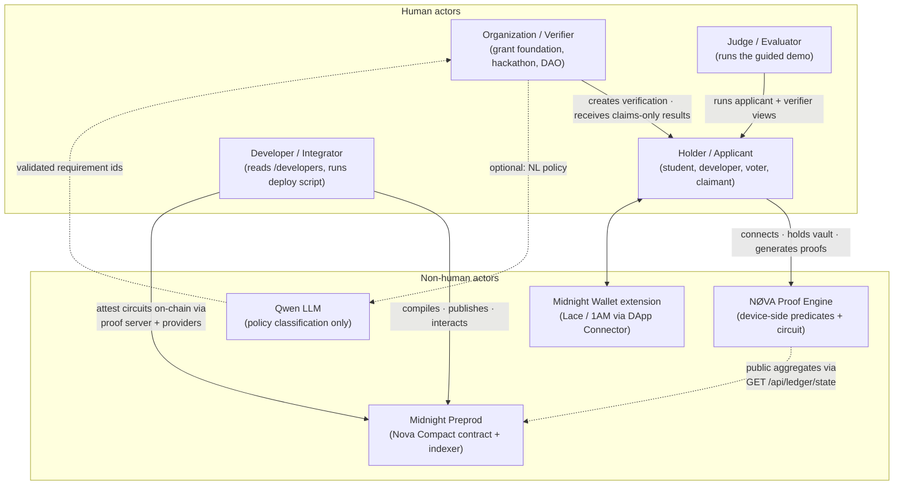

### Use cases

```mermaid
flowchart TB
    subgraph AC["NØVA application boundary"]
        direction LR
        UC1(["Browse proof-privacy landing"])
        UC2(["Launch guided demo<br/>/demo"])
        UC3(["Connect Midnight wallet"])
        UC4(["Create private vault<br/>(AES-GCM, device-bound)"])
        UC5(["Issue / receive credentials"])
        UC6(["Add custom credential"])
        UC7(["Generate private proof<br/>(claims-only)"])
        UC8(["Submit proof to scope"])
        UC9(["Generate reputation<br/>predicate proof"])
        UC10(["View activity log / clear"])
        UC11(["View verification result<br/>/verify/:id"])
        UC12(["Destroy vault"])
        UC13(["Create verification request"])
        UC14(["Compile NL policy →<br/>requirement ids"])
        UC15(["Share /grant link"])
        UC16(["Check received proofs"])
        UC17(["Switch engine mode<br/>(env-gated)"])
        UC18(["Read public ledger state<br/>(indexer)"])
        UC19(["Publish Nova contract<br/>deploy:ledger"])
        UC20(["Test contract interactions<br/>registerCredential · attest"])
        UC21(["Read developer docs"])
    end

    H(["Holder"]) --- UC1
    H --- UC2
    H --- UC3
    H --- UC4
    H --- UC5
    H --- UC6
    H --- UC7
    H --- UC8
    H --- UC9
    H --- UC10
    H --- UC12
    H --- UC21

    O(["Organization / Verifier"]) --- UC13
    O --- UC14
    O --- UC15
    O --- UC16
    O --- UC11
    O --- UC17

    J(["Judge / Evaluator"]) --- UC2
    J --- UC11

    D(["Developer / Operator"]) --- UC19
    D --- UC20
    D --- UC18
    D --- UC21

    W(["Midnight Wallet extension"]) -.-> UC3
    M(["Midnight Preprod<br/>Nova contract"]) -.-> UC8
    M -.-> UC19
    M -.-> UC20
    M -.-> UC18
    Q(["Qwen API"]) -.-> UC14

    UC7 -.->|«include»| UC4
    UC8 -.->|«include»| UC11
    UC13 -.->|«extend»| UC14
```

### 1. Core flow: connect → credential → select → prove → verify

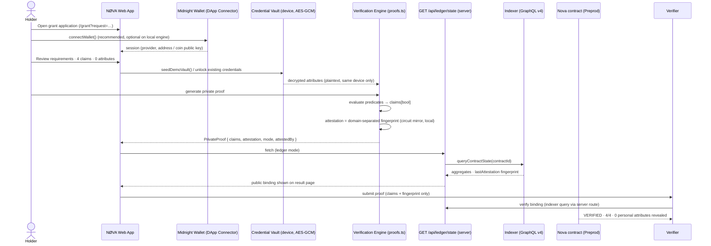

### 2. Guided demo (`/demo`)

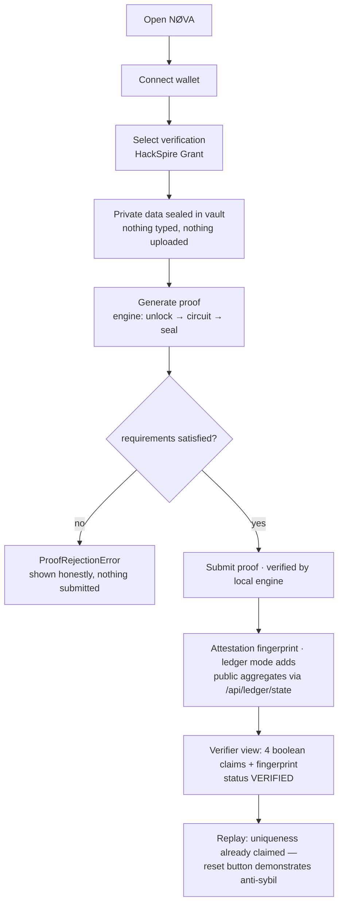

### 3. Verifier flow (`/dashboard/requests`)

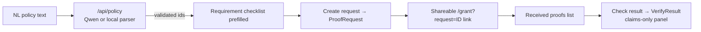

---

## App Screenshots

Captured headlessly from the **local production build** (`npm run build && npm run start`) with
`scripts/capture-screenshots.sh`, `NEXT_PUBLIC_MIDNIGHT_MODE` unset — i.e. **simulation mode**, so
these screens show locally-executed proofs and no ledger-bound state. The hosted Vercel deployment
is behind Deployment Protection and was not captureable anonymously.

| Desktop 1440×900 | Mobile 390×844 |
|---|---|
| 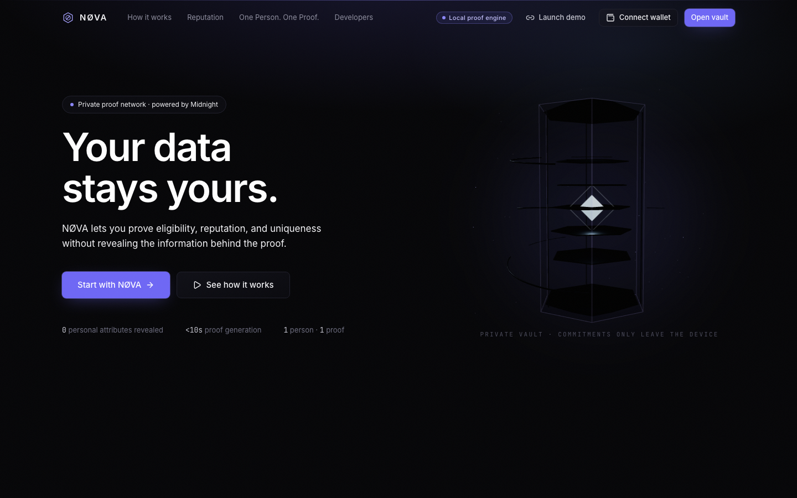<br/>Landing — WebGL vault hero | 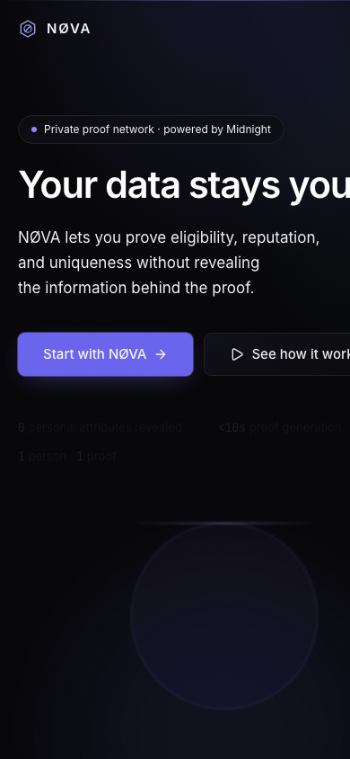<br/>Landing (390×844) |
| 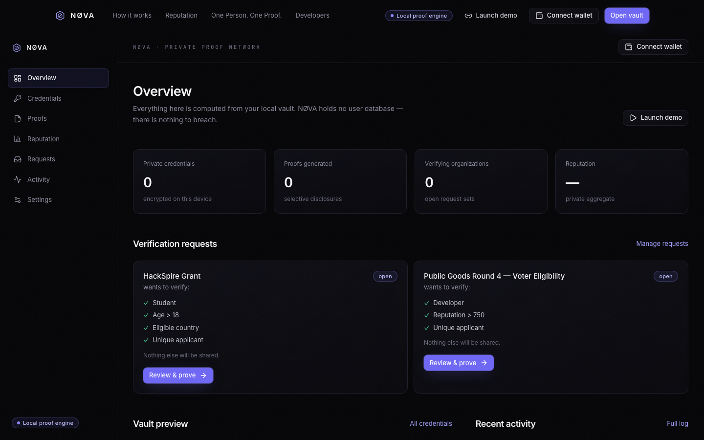<br/>Holder dashboard | 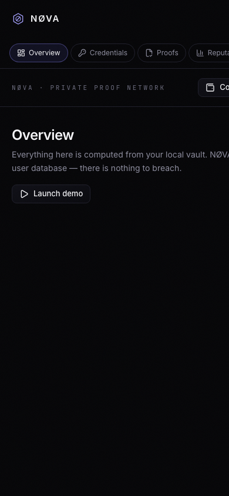<br/>Dashboard (390×844) |
| 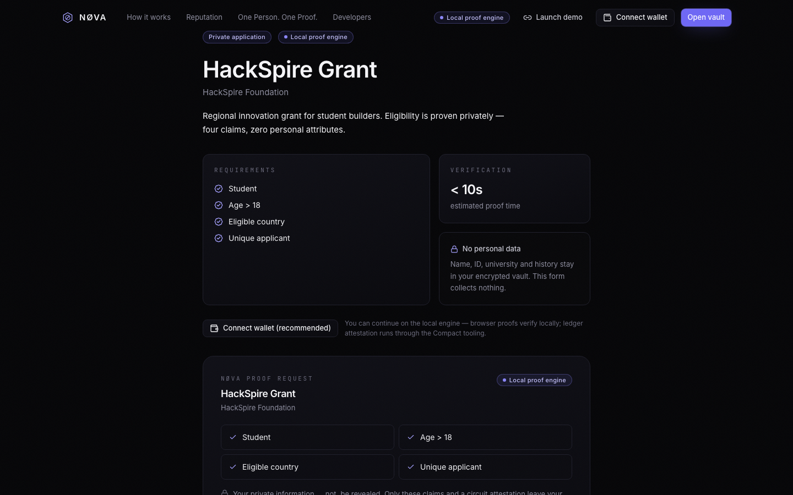<br/>Grant verification flow | 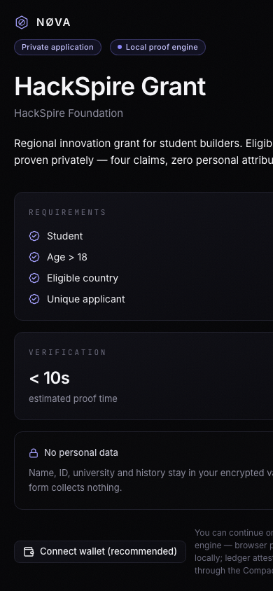<br/>Verification (390×844) |

Verification note: this environment cannot view images, so the set was checked automatically — all
six files are distinct (unique SHA-256), 149–706 KB each, and the 594 KB landing capture confirms
the React-Three-Fiber scene actually rasterised rather than an error page. They are published for a
human visual pass, not certified by one.

---

## App Surface

| Route | What it is |
|---|---|
| `/` | landing — hero, WebGL vault scene, architecture and data-to-proof flow |
| `/dashboard` | holder overview (live credential and proof counters) |
| `/dashboard/credentials` | the private credential vault |
| `/dashboard/proofs` | proof runner and history |
| `/dashboard/requests` | inbound verifier requests |
| `/dashboard/reputation` | scope reputation and attestations |
| `/dashboard/activity` | indexer-driven activity feed |
| `/dashboard/settings` | policy, disclosure and storage settings |
| `/verify/[id]` | public verification, no account required |
| `/demo`, `/grant`, `/developers` | scripted demo, grant application flow, integration guide |
| `/api/policy`, `/api/ledger/state` | server-side policy compilation; cached, timeout-bounded ledger reads |

---

## App Architecture

```
newproject/
├── contract/                 # NØVA Compact contract
│   ├── src/nova.compact      #   5 circuits: initialize, registerCredential, attest, suspend, resume
│   ├── src/witnesses.ts      #   witness derivation
│   ├── src/test/             #   circuit + metadata tests (Vitest)
│   └── src/managed/nova/     #   compiled artifacts: zkir/bzkir, proving + verification keys
├── src/
│   ├── app/                  # Next.js 15 App Router: pages, dashboard, /api routes
│   ├── components/           # ui primitives, site chrome, dashboard, home, WebGL scene
│   └── lib/
│       ├── midnight/         # network, crypto, credentials, proofs, wallet connector, contracts
│       ├── policy/           # local rule parser, Qwen compiler, client
│       └── store.ts          # session state
├── scripts/                  # wallet bootstrap, checkpointed sync, deploy, verify, evidence capture
└── docs/                     # diagrams, audit record, usage, feedback
```

- **Read path (browser):** the UI subscribes to the indexer over GraphQL/WebSocket and renders
  contract state; there is no seeded or simulated ledger data in the app.
- **Write path (server/CLI):** proving needs the local proof server, so deploy and circuit calls
  run through `scripts/` with a polkadot submission service, not from the browser.
- **Wallet connect:** the real injected DApp Connector under `window.midnight` (v4 plus the legacy
  `enable()` shape) with Midnight Lace or 1AM Wallet. No fabricated accounts, no mock balances —
  with no provider injected, the UI says so.
- **Sync strategy:** the v4 indexer dropped the per-block dust-event queries the old fast path used,
  so booting replays ~1.57M dust events on preprod. `scripts/lib/wallet-provider.ts` persists SDK
  wallet checkpoints and resumes from them; `scripts/supervise-deploy.sh` runs the replay in
  heap-bounded chunks. Measured: first full sync hours, resumed sync **42.8 s**.

---

## Quick Start

**Requirements:** Node `>=22 <26`, Docker for the proof server, Midnight Lace or 1AM Wallet, tNIGHT
from the [preprod faucet](https://midnight-tmnight-preprod.nethermind.dev/) for the deployer.

```bash
npm install
cp .env.example .env.local                    # set NEXT_PUBLIC_MIDNIGHT_MODE=ledger for real ledger state

docker run -d --rm -p 127.0.0.1:6300:6300 midnightntwrk/proof-server:8.1.0

npm run dev                                   # http://localhost:3000
```

Deploy to a network (publish → initialize → test every circuit → record the result):

```bash
npm run wallet:init preprod                   # local seed generation; prints only the address
npm run deploy:supervised preprod             # chunked sync to the tip, then deploy
npm run deploy:verify preprod <contract address>
```

---

## Hosting (Vercel)

Live at **https://nova-git-main-nandini-das-projects.vercel.app/**, built from `main`.

Repo side (committed): `vercel.json` declares the Next.js framework, `npm run build`, an
`npm install` install command, `bom1` functions and conservative response headers
(`nosniff`, `DENY` framing, strict referrer, no camera/mic/geolocation). `.nvmrc` pins Node 22,
inside the package's `engines` range (`>=22 <26`). No CSP is set — a nonce-based policy needs
`style-src` work on the Tailwind/inline-style output, so it is deliberately not claimed here.

The root build is `npm run build --workspace=nova-contract && next build`; the contract's
`prebuild` runs `compact` **only if the toolchain is on PATH** and otherwise uses the compiled
artifacts committed under `contract/src/managed/nova/`, so Vercel needs no Compact install.

**Environment variables to set in the Vercel dashboard** (Project → Settings → Environment
Variables). They are baked at build time, so a change needs a redeploy:

| Variable | Value |
|---|---|
| `NEXT_PUBLIC_MIDNIGHT_MODE` | `simulation` or `ledger` |
| `NEXT_PUBLIC_MIDNIGHT_NETWORK_ID` | `preprod` |
| `NEXT_PUBLIC_MIDNIGHT_INDEXER_URL` | `https://indexer.preprod.midnight.network/api/v4/graphql` |
| `NEXT_PUBLIC_MIDNIGHT_NODE_URL` | `https://rpc.preprod.midnight.network` |
| `NEXT_PUBLIC_MIDNIGHT_CONTRACT_ID` | the full preprod address from the deployment table below |

Never add `MIDNIGHT_WALLET_SEED`, `MIDNIGHT_PREPROD_SEED` or `MIDNIGHT_PRIVATE_STATE_PASSWORD` to
Vercel. Those are deploy-operator secrets for the local scripts; anything prefixed
`NEXT_PUBLIC_` is readable by every visitor's browser.

**One setting blocks the demo:** Vercel → Project → Settings → **Deployment Protection** → turn
*Vercel Authentication* off (or add a bypass secret to the URL). Until then, anonymous requests —
including a reviewer's — are redirected to `vercel.com/sso-api`, so the app cannot be opened.
Know the tradeoff before switching it off: `/api/policy` becomes reachable by anyone, it only
calls Qwen when a server-side `QWEN_API_KEY` is present, and nothing rate-limits it today.

---

## Scripts

| Script | Purpose |
|---|---|
| `npm run dev` / `build` / `start` | Next.js server and production build |
| `npm run lint` / `typecheck` | ESLint over `src` + `contract/src`; strict `tsc --noEmit` for both workspaces |
| `npm test` | contract circuit tests |
| `npm run contract` | recompile Compact artifacts |
| `npm run wallet:init` | generate a deploy seed locally |
| `npm run wallet:check` | funded / synced / fee-ready report |
| `npm run deploy:sync` | one bounded sync chunk (exit 0 = synced) |
| `npm run deploy:supervised` | chunk loop to completion, then deploy; aborts on a detected stall |
| `npm run deploy:heal` | recalibrate a drifted checkpoint cursor against the WASM tree oracle |
| `npm run deploy:ledger` | publish + initialize + exercise circuits, with stage timings |
| `npm run deploy:verify` | decode a deployed contract's public state from the indexer |

---

## What Is Not Verified

- **The registry is not live on either network.** `initialize` fails client-side before any
  proof request is made. The preprod run reaches `[7/8]` and aborts with
  `expected instance of StateValue`; the cause is a WASM runtime split between
  `compact-runtime` (which floated `onchain-runtime-v3` to 3.1.1) and `midnight-js-protocol`
  (which pins 3.0.0), so contract state built by one copy is rejected by the other's
  `_assertClass`. It is pinned to a single 3.0.0 copy in `package.json` + lockfile now; the
  redeploy had not cleared `initialize` at the time of writing.
- **No end-to-end credential → proof → verify run.** With no live registry, nothing has been
  registered or attested on-chain, so `credentialCount` and `proofCount` are both `0`.
- **Screenshots are machine-checked, not visually certified.** The six captures in
  [App Screenshots](#app-screenshots) are real renders of the local production build in
  **simulation mode** — verified distinct by SHA-256 and by file size (149–706 KB, so not Chrome
  error pages, and the 594 KB landing shot proves the WebGL scene rasterised). This environment
  cannot open images, so nobody has eyeballed layout, contrast or text wrapping, and the hosted
  ledger-configured screens are not among them.
- **The hosted app cannot be opened anonymously.** It is deployed from `main` at
  https://nova-git-main-nandini-das-projects.vercel.app/, but Vercel Deployment Protection answers
  `302 → vercel.com/sso-api` for `/` and `/dashboard` (verified 2026-09-30), so neither a reviewer
  nor I have confirmed which mode that build shipped in — `NEXT_PUBLIC_MIDNIGHT_MODE` and
  `NEXT_PUBLIC_MIDNIGHT_CONTRACT_ID` are baked at build time and are only observable through the
  running app. No on-chain flow is claimed *from that URL* in this README.
- **No CI pipeline in-repo.** The Vercel build is the only automated build; there is no workflow
  file, so there is no test badge to show.
- **The demo video is not verified from here.** It is the project's own recording; this environment
  cannot stream or view it, so nothing above attests to which state it shows. Since `initialize` had
  not cleared when the README was written, any ledger-bound credential → proof → verify flow in it
  would be from a local run rather than the published preprod contract.
