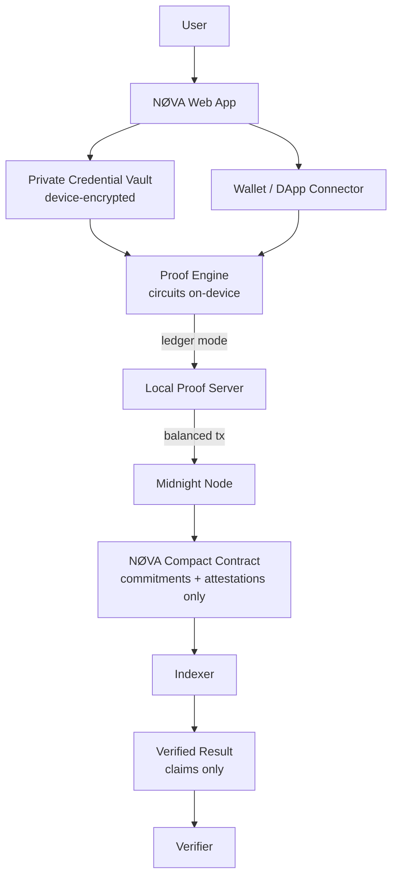

# NØVA

**Private Proof Network**

> **Prove what matters. Reveal nothing else.**

NØVA is a privacy-preserving credential and proof-of-eligibility platform built on
[Midnight](https://midnight.network). Holders prove claims — *student*, *over 18*,
*eligible country*, *unique applicant*, *reputation > 750* — through zero-knowledge
circuits, without revealing the information behind them. Verifiers receive booleans
and a circuit attestation. There is no identity database, server-side or otherwise:
**a breach of NØVA yields nothing about any person, because there is nothing there.**

---

## Application Preview

### Desktop

<p align="center">
  
</p>

### Mobile

<p align="center">
  
</p>

---

## Why NØVA

Verification today is over-collection. Every "are you a student?" question drags a
name, a document, an address and a birthdate through systems that will be breached,
sold, or subpoenaed. NØVA inverts the model:

```
MINIMIZE DATA → KEEP DATA PRIVATE → GENERATE PROOF → VERIFY CLAIM → REVEAL MINIMUM
```

| Traditional flow | NØVA flow |
| --- | --- |
| Upload your student ID | Prove `student = true` |
| Store DOB in their DB | Prove `age ≥ 18`, never store or send it |
| Connect a social account to check uniqueness | Scope-bound uniqueness attestation — one person, one proof |
| Your history becomes their liability | Your vault never leaves your device |

## Features

- **Private Identity Vault** — credentials encrypted at rest (AES-GCM, device-bound key, PBKDF2 210k iterations). Attributes are decrypted only inside the local proof engine.
- **Proof Generator** — requirement sets evaluated against the vault on-device; output is claims + a circuit-derived attestation fingerprint.
- **Private Reputation** — aggregate predicates ("reputation > 750", "5+ hackathons") proven from sealed credentials; the profile never surfaces.
- **One Person. One Proof.** — anti-sybil uniqueness bound to a campaign scope; a second claim by the same holder fails the circuit — no public identity required.
- **Verifier Dashboard** — publish requirement sets, share `/grant?request=…` links, receive claims-only results. Structurally incapable of collecting attributes.
- **Policy Engine** — natural-language policy → structured requirements via Qwen (OpenAI-compatible) with a deterministic local-parser fallback. AI classifies intent and has **zero cryptographic authority**: every id is validated against a closed catalog before verification.
- **Guided Demo + Grant flow** — the complete applicant ↔ verifier experience in under ten seconds.

## Tech stack

| Layer | Technology |
| --- | --- |
| Frontend | Next.js 15 (App Router) · React 19 · TypeScript (strict) · Tailwind CSS 4 · Framer Motion · React Three Fiber / Three.js (hero capsule) · Zustand |
| Contract | **Compact 0.23** compiled with the official `compact` CLI (devtools 0.5.1 / toolchain 0.31.1) → ZK circuits & verifier keys |
| Chain | Midnight **preprod / preview** · `@midnight-ntwrk` SDK family 4.1.1 · `compact-runtime` 0.16.0 · `compact-js` 2.5.1 · Wallet SDK · DApp Connector API 4.0.1 |
| Proving | Local Midnight proof server (`midnightntwrk/proof-server:8.1.0`, Docker, :6300) |
| AI | Qwen via OpenAI-compatible endpoint (optional) |
| Crypto | WebCrypto SHA-256 / AES-GCM / PBKDF2 (device vault + local engine commitments) |

## Architecture

Full diagram sources in [`docs/diagrams/`](./docs/diagrams).



**Code layering** — the UI never touches chain APIs directly:

```
src/app, src/components          UI
src/lib/requests.ts              request repository + activity
src/lib/policy/                  NL → requirement ids (Qwen/local, validated)
src/lib/midnight/                Midnight service layer
    wallet.ts      DApp Connector v4/legacy detection & connect
    network.ts     mode 'ledger' | 'simulation' + endpoints
    credentials.ts encrypted device vault
    proofs.ts      predicate engine, generateProof / verifyProof
    contracts.ts   circuit metadata + indexer public reads
contract/src/nova.compact        the Compact contract
scripts/deploy-ledger.ts         publish + initialize + test interactions
```

## Midnight integration

- `contract/src/nova.compact` — registry with operator bootstrap, credential
  commitments folded into a public accumulator, scope-bound attestations, and
  aggregate counters. Witnesses (`credentialSecret`, `holderEntropy`,
  `localAdminSecretKey`) never leave the client.
- **Real, not simulated**: contract compiled with the official Compact compiler;
  deployed with `@midnight-ntwrk/midnight-js-contracts` (`deployContract`) against a
  live Midnight test network through indexer/node/proof-server providers
  (`scripts/deploy-ledger.ts`, wallet path derived from Midnight Foundation's
  example-bboard).
- **Honest modes**: every proof view shows whether attestations bound to the
  network or to the **local proof engine** (which mirrors the circuit semantics with
  domain-separated SHA-256 and is labelled as such). No fake tx hashes, ever.

## Preprod / testnet deployment

See **Midnight Deployment** below — populated with real on-chain values from the
verified publish (`scripts/deploy-ledger.ts` → `.deploy/nova-contract.json`,
`scripts/verify-deployment.ts`).

Re-verify anytime (read-only, no wallet needed):

```bash
npm run build --workspace=nova-contract
npx tsx scripts/verify-deployment.ts
```

## Privacy model

- **Zero attribute egress.** Verifiers receive `ProofClaim[]` + attestation fingerprint. `PrivateProof.commitmentsRevealed` is a type-level literal `false`.
- **No user database.** All holder state lives in browser storage encrypted under a device root key; the deploy scripts' private-state store holds only circuit witnesses for the operator flow.
- **Uniqueness without identity.** Attestations bind (credential, campaign, single-use entropy); nothing linkable across campaigns is released.
- **AI is an advisor, not a verifier.** Policy output is untrusted input, validated against the closed `RequirementId` catalog before the engine runs.
- Environment hygiene: seeds live only in `.env.local` (git-ignored); `.env.example` carries no secrets.

## User flow

```mermaid
sequenceDiagram
    actor H as Holder
    participant App as NØVA
    participant V as Vault (device)
    participant E as Proof Engine
    participant M as Midnight
    participant O as Verifier
    H->>App: open grant / verification
    H->>App: connect Midnight wallet (DApp Connector)
    H->: V: unlock private credentials
    H->>E: generateProof(request, credentials)
    E->>E: evaluate predicates → claims
    E->>M: attest scope (circuit tx, proof server)
    M-->>E: attestation recorded
    E-->>O: claims + fingerprint
    O->>M: verify binding (indexer)
    M-->>O: VERIFIED · 0 attributes revealed
```

## Smart contract

| Surface | Type | What the ledger learns |
| --- | --- | --- |
| `initialize` | impure | operator public key, registry LIVE |
| `registerCredential(issuer)` | impure | accumulator fold of `nova:credential:` commitment, counter +1 |
| `attest(scope)` | impure | attestation fingerprint `nova:attestation:`, scope, counter +1 |
| `suspend` / `resume` | impure | status transitions (operator-only) |
| `operatorPublicKey`, `credentialCommitmentFor`, `accumulatorNext`, `attestationFor` | pure circuits | — (clients may run them off-circuit) |

Public ledgers: `status, owner, sequence, credentialAccumulator, credentialCount, proofCount, lastAttestation, lastAttestationScope` — aggregates and digests only.

## Midnight Deployment

| Property | Details |
| --- | --- |
| Network | **Midnight Preview** *(testnet — preprod DUST-grace blocked a same-day publish; see below)* |
| Contract | `Nova` |
| Contract Address | `DEPLOY_ADDRESS` |
| Deployment Transaction | `DEPLOY_TX` |
| Deployer | `DEPLOYER_ADDRESS` |
| Block | `DEPLOY_BLOCK` |
| Compact Version | compiler devtools 0.5.1 / toolchain 0.31.1 / runtime 0.16.0 (language `pragma 0.23`) |
| Midnight SDK | `@midnight-ntwrk/midnight-js-*` 4.1.1 · compact-js 2.5.1 · DApp Connector 4.0.1 |
| Proof Server | `midnightntwrk/proof-server:8.1.0` (Docker, :6300) |
| Status | `DEPLOY_STATUS` |
| Deployment Date | `DEPLOY_DATE` |

Explorer: https://preview.midnightexplorer.com · https://preprod.midnightexplorer.com

**Why Preview, not Preprod (this run).** Both attempts were real. On Preprod the
official dev wallet's faucet UTXOs accrue DUST only after a ~3h network grace period,
so fee funding could not complete within the same session. Preview is the documented
test network for active development, its faucet pays in, and its DUST becomes
spendable quickly. To (re-)deploy on Preprod at any time:

```bash
npm run deploy:ledger preprod   # funds → rotate registration → grace wait → publish
```

## Setup

```bash
npm install
npm run build --workspace=nova-contract   # compiles nova.compact (requires `compact` CLI)
cp .env.example .env.local                # optional: wallet seed / contract id / Qwen key
npm run dev                               # http://localhost:3000
```

Proof server (required only for ledger-mode interactions):

```bash
docker run -d -p 6300:6300 midnightntwrk/proof-server:8.1.0
```

| Script | Purpose |
| --- | --- |
| `npm run dev / build / start / lint / typecheck / test` | app lifecycle + quality gates |
| `npm run contract` | recompile Compact contract artifacts |
| `npm run deploy:ledger [preview\|preprod]` | publish contract, initialize, test interactions |
| `npx tsx scripts/check-wallet.ts <net>` | read-only wallet health (tNIGHT/tDUST/UTXOs) |
| `npx tsx scripts/verify-deployment.ts` | indexer read-back of the deployed contract |

## Project structure

```
contract/            nova.compact + compiler-managed artifacts (circuits, ZKIR, keys)
docs/                diagrams/ (Mermaid) · screenshots/
public/              favicon assets · demo-seed utility
scripts/             deploy-ledger · check-wallet · verify-deployment · lib/ (providers)
src/
  app/               routes: landing, /demo, /grant, /verify/[id], /developers,
                     /dashboard/* (7 pages), /api/policy, /api/ledger/state
  components/        ui/ primitives · scene/ (R3F capsule) · home/ · dashboard/ · app/
  lib/
    midnight/        the ONLY Midnight-facing module set
    policy/          policy engine (server + client-safe parts separated)
```

## Screenshots

| Desktop (1440×900) | Mobile (390×844) |
| --- | --- |
|  |  |
|  |  |

## Security

- Contract semantics reviewed against Midnight's disclosure model: only commitments and aggregates are `disclose`d; all identity material is `witness` input.
- Fail-closed vault: a corrupt/moved vault throws rather than silently reseeding.
- Deploy tooling: seeds are read from `.env.local` only; the repo (and `.env.example`) contain zero secrets. Testnets only — mainnet deployment requires Foundation authorization (see docs).
- Dependency hygiene: no unused libraries; strict TS; `no-explicit-any` enforced, narrow exceptions documented in `scripts/`.

## Roadmap

- [ ] Multi-issuer credential bindings (per-issuer registry slots on-chain)
- [ ] Nullifier-tree uniqueness at protocol level (beyond scope-bound attestations)
- [ ] Webhook push model for verifier results (`nova.proof.verified`)
- [ ] `create-mn-app` template for NØVA integrators
- [ ] Mainnet deployment after preprod soak + Foundation review

## Contributing

Fixes start with the contract: `npm run contract && npm test` (metadata tests guard
circuit/ledger surface drift). UI changes must pass `lint + typecheck` and never
reach past the `src/lib/midnight` boundary.

## License

Apache-2.0. Contract witness-crypto patterns derived from Midnight Foundation's
example-bboard (Apache-2.0); attributed in file headers.
# N-VA
