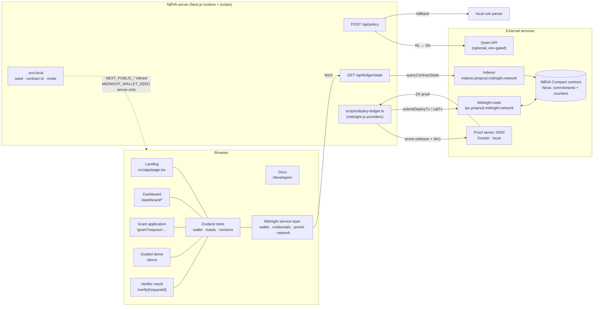

# NØVA — Application Diagram (end-to-end)

## Route map

| Route | Purpose | Data touched |
| --- | --- | --- |
| `/` | marketing + live interactive proof | vault (read), proofs (write) |
| `/dashboard` | overview: stats, requests, activity | vault, proofs, requests |
| `/dashboard/credentials` | vault: issue / prove / seal | vault (CR) |
| `/dashboard/proofs` | generated proofs, verifier view | proofs (R) |
| `/dashboard/reputation` | predicate proofs over aggregates | vault (R), proofs (W) |
| `/dashboard/requests` | verifier: create + check results | requests (CR), proofs (R) |
| `/dashboard/activity` | local audit trail | activity (R) |
| `/dashboard/settings` | mode, wallet, custody, destroy | env, vault |
| `/demo` | guided applicant ↔ verifier scenario | vault, proofs |
| `/grant` | shareable private application | requests (R), proofs (W) |
| `/verify/[id]` | claims-only verification result | proofs (R) |
| `/developers` | integration docs | none |
| `POST /api/policy` | NL → requirement ids | none persisted |
