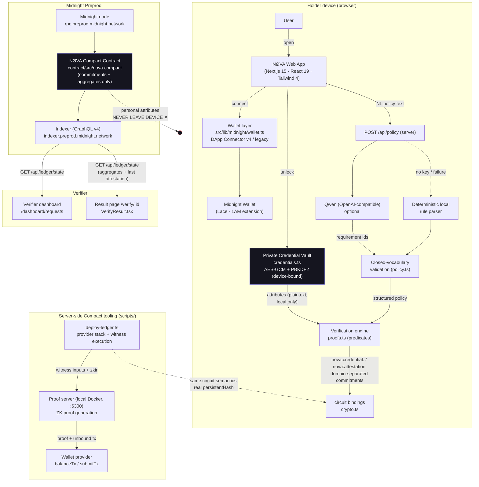

# NØVA — System Architecture



## Layers (code mapping)

```
UI            src/app, src/components        — renders states, never touches chain APIs directly
              (landing, dashboard, /grant, /demo, /verify/[id], /developers)

Application   src/lib/requests.ts            — verification request repository + activity log
service       src/lib/policy/*               — NL → requirement ids (Qwen/local, validated)
              src/lib/store.ts               — zustand: wallet session, toasts, invalidation

Midnight      src/lib/midnight/network.ts    — mode ('ledger' | 'simulation'), endpoints
service layer src/lib/midnight/wallet.ts     — DApp Connector detection + connectWallet()
              src/lib/midnight/credentials.ts— encrypted vault: issueCredential(), getPrivateCredentials()
              src/lib/midnight/proofs.ts     — generateProof(), verifyProof(), predicates
              src/lib/midnight/contracts.ts  — circuit/ledger metadata + contract-id validation
              src/app/api/ledger/state/      — server route: indexer read of public state
              src/lib/midnight/crypto.ts     — commitments mirroring nova.compact domain separation

Contract      contract/src/nova.compact      — Compact 0.23 → compiled circuits/ZKIR (src/managed/nova)
              scripts/deploy-ledger.ts       — provider stack, deployContract, test interactions
```

## Trust boundaries

| Boundary | What crosses it | What never crosses it |
| --- | --- | --- |
| Vault → proof engine | attribute plaintext (same device, decrypted locally) | — |
| Holder → Midnight | one-way commitments, accumulator folds, attestation fingerprints, aggregate counters | names, DOB, student IDs, region codes, reputation inputs |
| Qwen → NØVA | requirement ids (untrusted, validated) | authority over verification |
| NØVA servers → anyone | no user data exists server-side | — |
