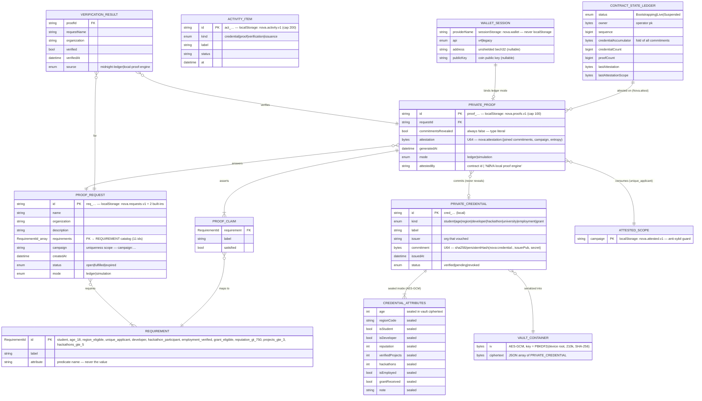

# NØVA — Data Model (ER)

Generated from the actual types in `src/lib/midnight/types.ts`,
`src/lib/requests.ts` and `src/lib/policy/policy.ts`. There is no server-side
database: everything below lives either in the holder's encrypted browser
storage or on-chain.

## Persistence map (all device-local)

| Storage key | Owner module | Contents |
| --- | --- | --- |
| `nova.device.root.v1` | credentials.ts | 32-byte device key (PBKDF2 input) |
| `nova.vault.v1` | credentials.ts | encrypted vault container |
| `nova.requests.v1` | requests.ts | org-created requests |
| `nova.proofs.v1` | proofs.ts | generated proofs |
| `nova.attested.v1` | proofs.ts | consumed uniqueness scopes |
| `nova.activity.v1` | requests.ts | local audit trail |
| `nova.wallet` (sessionStorage) | store.ts | wallet session, cleared per tab |
| `nova-private-state-preprod` (LevelDB) | deploy-ledger.ts | circuit witnesses (server/deploy side) |

## Contract-side model (public state only)

Compact `ledger` declarations in `nova.compact`: `status`, `owner`, `sequence`,
`credentialAccumulator`, `credentialCount`, `proofCount`, `lastAttestation`,
`lastAttestationScope`. `witness` inputs (`localAdminSecretKey`,
`credentialSecret`, `holderEntropy`) exist only in private state — the ER model
above shows their client-side shape, never a server-side column.
