# NØVA — Use-Case Diagram

Actors and functionality as actually implemented in this repository.

```mermaid
flowchart TB
    subgraph AC["NØVA application boundary"]
        direction LR
        UC1(["Browse proof-privacy landing"])
        UC2(["Launch guided demo<br/>/demo"])
        UC3(["Connect Midnight wallet"])
        UC4(["Create private vault<br/>(AES-GCM, device-bound)"])
        UC5(["Issue / receive credentials"])
        UC6(["Add custom credential"])
        UC7(["Generate private proof<br/>(claims-only)"])
        UC8(["Submit proof to scope"])
        UC9(["Generate reputation<br/>predicate proof"])
        UC10(["View activity log / clear"])
        UC11(["View verification result<br/>/verify/:id"])
        UC12(["Destroy vault"])
        UC13(["Create verification request"])
        UC14(["Compile NL policy →<br/>requirement ids"])
        UC15(["Share /grant link"])
        UC16(["Check received proofs"])
        UC17(["Switch engine mode<br/>(env-gated)"])
        UC18(["Read public ledger state<br/>(indexer)"])
        UC19(["Publish Nova contract<br/>deploy:ledger"])
        UC20(["Test contract interactions<br/>registerCredential · attest"])
        UC21(["Read developer docs"])
    end

    H(["Holder"]) --- UC1
    H --- UC2
    H --- UC3
    H --- UC4
    H --- UC5
    H --- UC6
    H --- UC7
    H --- UC8
    H --- UC9
    H --- UC10
    H --- UC12
    H --- UC21

    O(["Organization / Verifier"]) --- UC13
    O --- UC14
    O --- UC15
    O --- UC16
    O --- UC11
    O --- UC17

    J(["Judge / Evaluator"]) --- UC2
    J --- UC11

    D(["Developer / Operator"]) --- UC19
    D --- UC20
    D --- UC18
    D --- UC21

    W(["Midnight Wallet extension"]) -.-> UC3
    M(["Midnight Preprod<br/>Nova contract"]) -.-> UC8
    M -.-> UC19
    M -.-> UC20
    M -.-> UC18
    Q(["Qwen API"]) -.-> UC14

    UC7 -.->|«include»| UC4
    UC8 -.->|«include»| UC11
    UC13 -.->|«extend»| UC14
```

## Use-case notes

| Use case | Code path | Key rule |
| --- | --- | --- |
| Generate private proof | `proofs.generateProof()` | claims computed locally; rejection surfaces truthfully |
| Submit proof to scope | `ProofRunner.submit()` → contract `attest` in ledger mode | scope-bound attestation; second claim fails |
| Reputation predicate proof | `proofs.generateReputationProof()` | aggregate-only, thresholds provable |
| Compile NL policy | `/api/policy` → Qwen/local | output validated against closed catalog; zero crypto authority |
| View result | `/verify/[id]` → `verifyProof()` | structurally cannot render attributes |
| Destroy vault | settings | irreversible, device-local |
| Publish contract | `scripts/deploy-ledger.ts` | real tx + verified indexer read-back |
