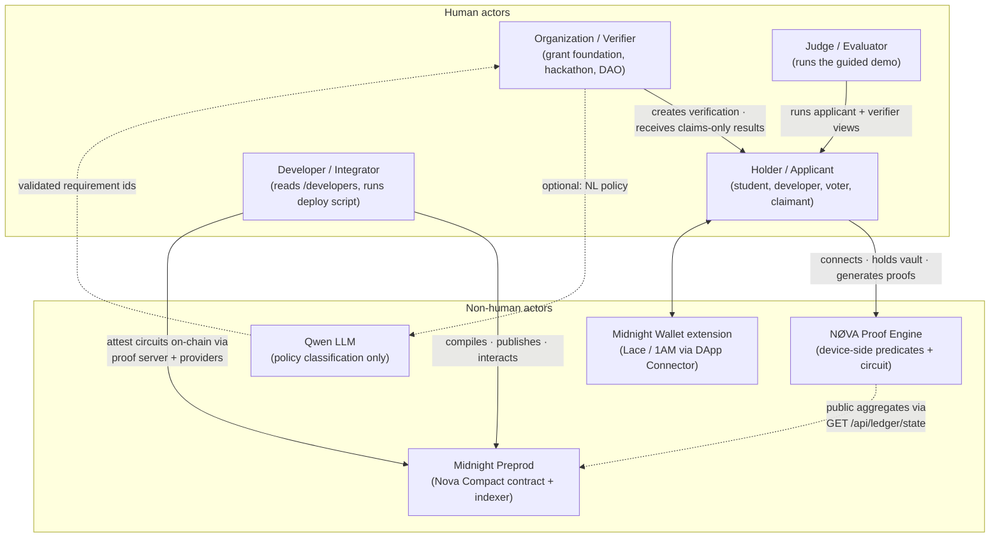

# NØVA — Actors & Users

| Actor | Primary jobs | Auth surface |
| --- | --- | --- |
| Holder | unlock vault, review requests, generate + submit private proofs | device key (+ wallet for ledger mode) |
| Organization | define requirement sets (checkboxes or NL policy), share `/grant?request=…` links, view results | none — claims are public to the holder |
| Developer | compile `nova.compact`, deploy via providers, integrate SDK | `MIDNIGHT_WALLET_SEED` (server-side only) |
| Midnight wallet | sign transactions, expose accounts | extension |
| Qwen | classify free text → requirement ids | `QWEN_API_KEY` (optional) |
