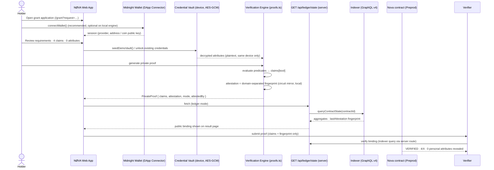
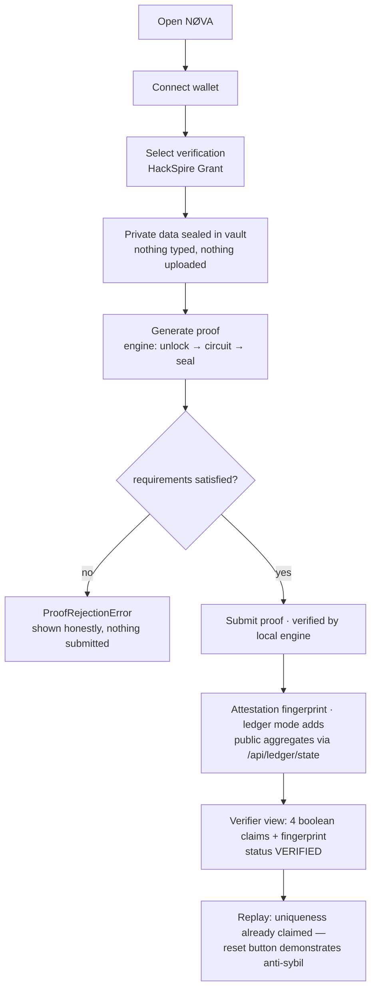
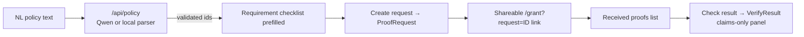

# NØVA — User Flows

## 1. Core flow: connect → credential → select → prove → verify

> Browser proofs are computed and verified **entirely on-device**; the Compact circuits
> (`registerCredential` / `attest` with real ZK proofs from the local proof server)
> are executed on-chain by the server-side tooling (`scripts/deploy-ledger.ts`),
> not by the browser. See `docs/diagrams/architecture.md`.

## 2. Guided demo (`/demo`)

## 3. Verifier flow (`/dashboard/requests`)

## 4. Failure paths (all surfaced in the UI, never silent)

| Path | Behavior |
| --- | --- |
| No wallet | continue on local engine (labelled); ledger mode shows install guidance |
| Empty vault | empty state + one-click `Request demo credentials` |
| Predicate unsatisfied | `ProofRejectionError` toast + inline error, proof never leaves device |
| Duplicate uniqueness claim (same holder, same scope) | rejection: "One person, one proof" |
| Corrupt vault (wrong device key) | fail-closed: "Vault could not be decrypted on this device" |
| Ledger misconfigured | explicit badge `Local proof engine` — never a fake on-chain claim |
| Qwen down / no key | deterministic local rule parser + honest note in the result |
